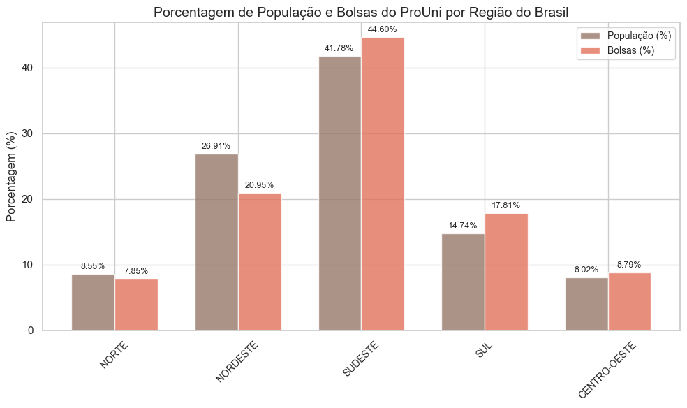
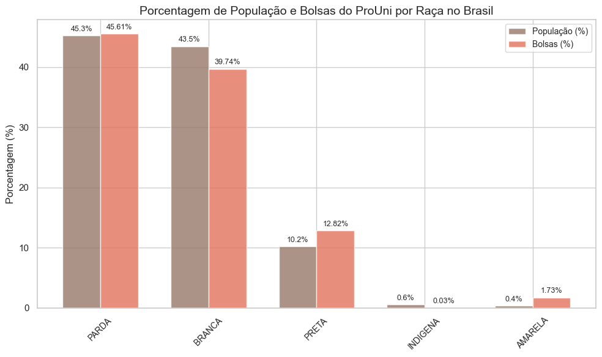
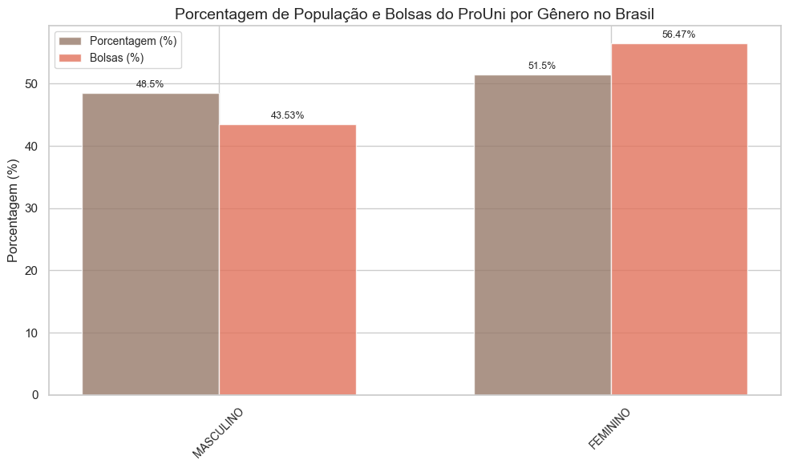
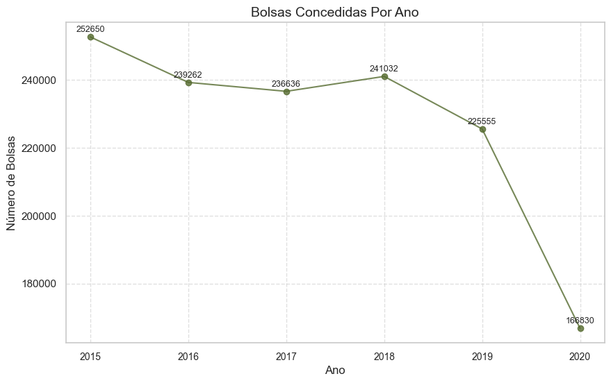
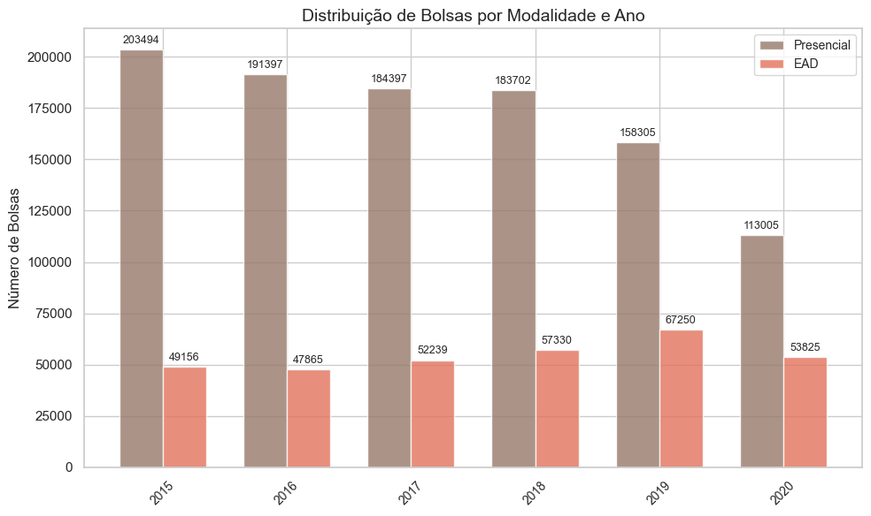

# Análise de Dados do ProUni

Este repositório contém uma análise detalhada dos dados do Programa Universidade para Todos (ProUni), que oferece bolsas de estudo em instituições privadas de ensino superior. O objetivo é entender como as bolsas são distribuídas ao longo dos anos, considerando fatores como região, raça, gênero e modalidade de ensino.

## Tecnologias Utilizadas
- Python (Pandas, Matplotlib, Seaborn, NumPy)
- PostgreSQL (para armazenamento dos dados)
- SQLAlchemy & Psycopg2 (para conexão com o banco de dados)
- Jupyter Notebook / Scripts Python

## O que você vai encontrar aqui?

### 1. **Códigos de Análise**
   - **`projeto_prouni.py`**: Este código faz a limpeza, organização e análise dos dados do ProUni. Ele lê arquivos CSV de diferentes anos, unifica os dados, padroniza as colunas e envia tudo para um banco de dados PostgreSQL.
   - **`analise_prouni.py`**: Aqui, os dados são recuperados do banco de dados e transformados em gráficos que mostram a distribuição das bolsas por região, raça, gênero e ano. Também há uma análise comparativa entre a população brasileira e o número de bolsas concedidas.

### 2. **Dados Utilizados**
   - Os dados são provenientes dos arquivos CSV do ProUni, disponíveis publicamente, e incluem informações sobre bolsas concedidas entre 2015 e 2020.
   - Para comparação, foram utilizados dados do Censo 2022 sobre população por região, raça e gênero.

### 3. **Gráficos e Insights**
   - **Distribuição por Região**: Compara a porcentagem da população com a porcentagem de bolsas concedidas em cada região do Brasil.

   - **Distribuição por Raça**: Mostra como as bolsas são distribuídas entre diferentes grupos raciais, comparando com a composição racial da população.

   - **Distribuição por Gênero**: Analisa a proporção de bolsas concedidas a homens e mulheres em relação à população geral.

   - **Evolução ao Longo dos Anos**: Mostra como o número de bolsas variou de 2015 a 2020.

   - **Modalidade de Ensino**: Compara a quantidade de bolsas para cursos presenciais e a distância (EAD).

### 5. **Como Executar o Projeto**
   1. Clone este repositório:
      ```bash
      git clone https://github.com/seu-usuario/prouni-analysis.git
      ```
   2. Instale as dependências:
      ```bash
      pip install -r requirements.txt
      ```
   3. Configure o banco de dados PostgreSQL com as credenciais no arquivo `.env`.
   4. Execute os scripts:
      - Para análise e preparação dos dados:
      ```bash
      python projeto_prouni.py
      ```
      - Para visualização dos gráficos:
      ```bash
      python analise_prouni.py
      ```
        
### 6. **Por Que Este Projeto é Interessante?**
   - Ele ajuda a entender como o ProUni está distribuindo suas bolsas e se há equilíbrio em relação à população brasileira.
   - Os gráficos gerados são fáceis de interpretar e mostram de forma clara as tendências e desigualdades.
   - É um exemplo prático de como dados públicos podem ser utilizados para gerar insights relevantes.

### Próximos Passos
   - Adicionar novas análises sobre cursos e instituições
   - Melhorar a performance do código com otimizações SQL
   - Descobrir o motivo da queda de inscritos no programa a partir de 2015

